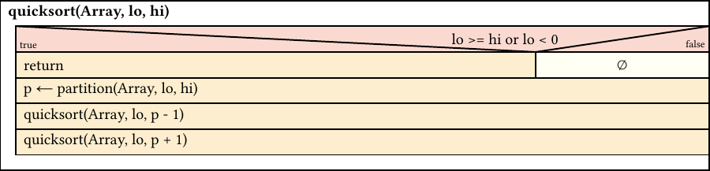

<!--end_slide-->

Inhalt
======
1. Grundlegende Eigenschaften des Algorithmus
  - Einzelheiten
  - Grober Ablauf
2. Nassi-Schneider Diagramm (Struktogramm)
3. Implementatitionen (Java, C, Gleam)

<!--end_slide-->
<!--jump_to_middle-->
Grundlegende Eigenschaften des Algorithmus
==========================================

<!--end_slide-->
Grundlegende Eigenschaften des Algorithmus
==========================================

# Einzelheiten
- Entwickelt in 1959 von *Tony Hoare*
<!--new_line-->
- "comparison sort"
  -> *abstrakte Vergleichsoperation* zur Bestimmung der Ordnung
<!--new_line-->

- meist *unstable* -> Erhalt der relativen Ordnung von Elementen zueinander mit
  gleichen *Keys* nicht garantiert

<!--end_slide-->
Unstable Sortieralgorithmen
===========================
```java
class Book {
  String author;
  int nPages; // <- sort key
  // constructor ..
}
```

<!--end_slide-->
Unstable Sortieralgorithmen
===========================

<!--column_layout: [1, 1]-->
<!--column: 0-->
```java
Book[] books = {
  new Buch("Bob", 420),
  new Buch("Der coole Bob", 6942),
  new Buch("Leo (Kawaii)", 420),
  new Buch("Harald Topfer", 690)
};
stableSortByPages(books);
```
<!--pause-->
## Elemente nach Sortierung

1. Bob,            420 Seiten
2. Leo (Kawaii),   420 Seiten
3. Harald Topfer,  690 Seiten
4. Der coole Bob,  69420 Seiten

<!--pause-->

<!--column: 1-->
```java
Book[] books = {
  new Buch("Bob", 420),
  new Buch("Der coole Bob", 6942),
  new Buch("Leo (Kawaii)", 420),
  new Buch("Harald Topfer", 690)
};
unstableSortByPages(books);
```
<!--pause-->
## Elemente nach Sortierung
1. Leo (Kawaii),   420 Seiten
2. Bob,            420 Seiten
3. Harald Topfer,  690 Seiten
4. Der coole Bob,  69420 Seiten

<!--reset_layout-->

<!--end_slide-->
Big-O Notation
==============
```typst +render
$O(n)$
```
- stark simplifizierte Angabe der Effizienz eines Algorithmus
- Komplexizitaet des Algorithmus relativ zu dessen Input
- Unterscheidung von *Time-Complexity* und *Space-Complexity*
<!--pause-->

## Beispiele
<!--column_layout: [1, 1, 1, 1]-->
<!--column: 0-->
```typst +render
$O(n^2)$
```
<!--pause-->
Genestete For-Loops

<!--column: 1-->
```typst +render
$O(n)$
```
<!--pause-->
Einfacher For-Loop
(Ausgeben eines Arrays)
<!--column: 2-->
```typst +render
$O(1)$
```
<!--pause-->
Array indexing
<!--column: 3-->
```typst +render
$O(log n)$
```
<!--pause-->
Binary Search
<!--reset_layout-->

<!--end_slide-->

Grundlegende Eigenschaften des Algorithmus
==========================================
# Eigenschaften
- meist etwas schneller als vergleichbare Algorithmen (Heapsort, Mergesort)
- durschnittliche Time-Complexity
```typst +render
$O(n log n)$
```
- schlechteste Time-Complexity;
```typst +render
$O(n^2)$
```
- kann variiert je nach *Partitionsschema* variieren

<!--end_slide-->

Grundlegende Eigenschaften des Algorithmus
==========================================
- das Sortierverfahren kann *in-place* durchgefuehrt werden -> Space-Complexity
```typst +render
$O(n)$
```
<!--pause-->
## *in-place*
> Kein weiteres Array zum einsortieren noetig!
> Das Inputarray kann in "sich selbst sortiert" werden.

<!--end_slide-->

Ablauf
=============
- sogenannter *divide-and-conquer* Algorithmus
<!--new_line-->
<!--incremental_lists: true-->
1. *Pivot-Element* wird aus dem Array gewaehlt
2. *Aufteilung* (divide) des Arrays in zwei Subarrays -> (Partitionierung)
3. Nach jeder Partitionierung, ist das Pivot-Element an korrekter Stelle
4. Subarrays werden durch Rekursion ebenfalls sortiert
<!--incremental_lists: false-->

<!--pause-->
-> Partitionsschema koennen dabei variieren

<!--end_slide-->
Partitionsschema
================
- es gibt zwei wesentliche Schema:
<!--column_layout: [1, 1]-->
<!--column: 0-->
## Lomuto-Partitionsschema
- einfacher zu verstehen
- geringere Perfomance 
  -> bereits sortiertes Array
<!--column: 1-->
## Hoare-Partitionsschema
- urspruengliche entwickeltes Schema
- schwieriger zu verstehen
- bessere Perfomance 
<!--reset_layout-->

<!--end_slide-->
<!--jump_to_middle-->
Nessi-Schneider Diagramm
========================
<!--end_slide-->
Nessi-Schneider Diagramm
========================
# Quicksort


<!--end_slide-->
Nessi-Schneider Diagramm
========================
# Partitionierung


<!--end_slide-->
<!--jump_to_middle-->
Implementationen
================
<!--end_slide-->
Implementation - Java
=====================

# Java
```java {2-9|11-31|0-100}
public class QS {
    private static void quicksort(int[] arr, int lo, int hi) {
        if (lo >= hi || lo < 0) { return; }

        int p = partition(arr, lo, hi);

        quicksort(arr, lo, p - 1);
        quicksort(arr, p + 1, hi);
    }

    private static int partition(int[] arr, int lo, int hi) {
        int pivot = arr[hi];
        int temp_pivot = lo;

        for (int i = lo; i < hi; i++) {
            if (arr[i] <= pivot) {
                // swap
                int temp = arr[temp_pivot];
                arr[temp_pivot] = arr[i];
                arr[i] = temp;

                temp_pivot += 1;
            }
        }
        // swap
        int temp = arr[temp_pivot];
        arr[temp_pivot] = arr[hi];
        arr[hi] = temp;

        return temp_pivot;
    }
}
```
